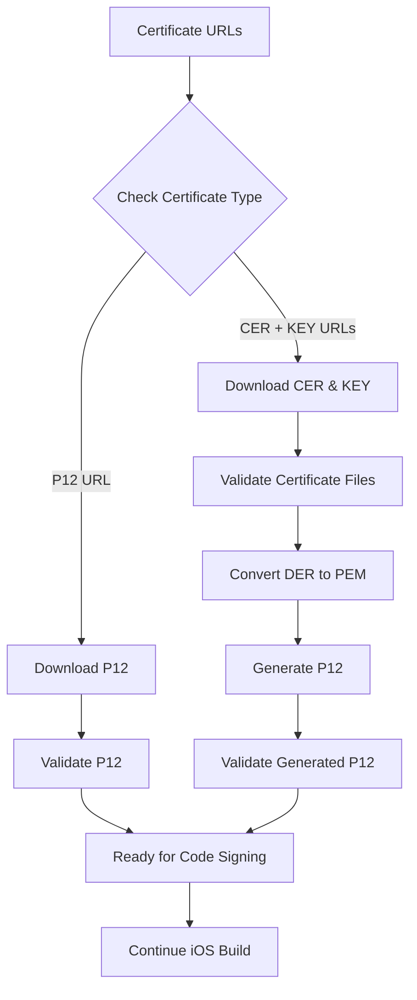

# 🔐 Certificate Generation Integration Guide

## 📋 Overview

The iOS workflow has been enhanced with comprehensive certificate generation functionality that supports both direct P12 downloads and CER/KEY to P12 conversion with proper format handling.

## 🚀 Enhanced Features

### **1. Certificate Format Detection**
- **Automatic Detection**: Detects DER and PEM certificate formats
- **Format Validation**: Validates certificate integrity before processing
- **Error Handling**: Comprehensive error reporting for invalid certificates

### **2. Enhanced Certificate Generation**
- **DER to PEM Conversion**: Automatically converts DER certificates to PEM format
- **P12 Generation**: Creates password-protected P12 files with proper metadata
- **Certificate Chain Validation**: Validates certificate chains and relationships

### **3. Robust Download System**
- **Multiple Download Methods**: wget (primary) with curl fallbacks
- **Retry Logic**: Automatic retry with exponential backoff
- **Network Validation**: DNS and HTTPS connectivity testing

## 🔧 Integration Points

### **Step 3: Enhanced Certificate Handling**

The certificate generation is integrated into **Step 3** of the iOS workflow:

```bash
# Step 3: Download iOS Certificates and Files with Enhanced Certificate Generation
log_info "Step 3: Download iOS Certificates and Files with Enhanced Certificate Generation"
```

### **Certificate Processing Flow**



## 📝 Configuration Options

### **Option 1: Direct P12 Download**
```bash
CERT_P12_URL="https://raw.githubusercontent.com/prasanna91/QuikApp/main/Certificates.p12"
CERT_PASSWORD="quikapp2025"
```

### **Option 2: CER/KEY to P12 Generation**
```bash
CERT_CER_URL="https://raw.githubusercontent.com/prasanna91/QuikApp/main/ios_distribution_gps.cer"
CERT_KEY_URL="https://raw.githubusercontent.com/prasanna91/QuikApp/main/private.key"
CERT_PASSWORD="quikapp2025"
```

## 🔍 Certificate Validation Functions

### **1. Format Detection**
```bash
detect_certificate_format() {
    local file_path="$1"
    # Detects DER, PEM, or UNKNOWN formats
}
```

### **2. Certificate Validation**
```bash
validate_certificate_file() {
    local file_path="$1"
    local file_type="$2"
    # Validates certificate integrity and extracts metadata
}
```

### **3. P12 Generation**
```bash
generate_p12_from_certificates() {
    local cer_file="$1"
    local key_file="$2"
    local p12_file="$3"
    local password="$4"
    # Handles DER to PEM conversion and P12 generation
}
```

### **4. P12 Validation**
```bash
validate_p12_file() {
    local p12_file="$1"
    local password="$2"
    # Validates P12 structure and password
}
```

## 📊 Certificate Information Extraction

The enhanced workflow extracts and logs detailed certificate information:

### **Certificate Details**
- **Subject**: Organization and team information
- **Issuer**: Certificate authority details
- **Expiration**: Validity period
- **Format**: DER or PEM detection
- **Size**: File size validation

### **Private Key Details**
- **Key Size**: RSA key length
- **Format**: PEM format validation
- **Integrity**: Key structure validation

### **P12 Details**
- **Certificate Count**: Number of certificates in P12
- **Private Key Count**: Number of private keys in P12
- **Encryption**: Triple DES encryption
- **MAC**: SHA1 message authentication

## 🛠️ Error Handling

### **Download Failures**
```bash
# Multiple fallback methods
1. wget (primary)
2. curl with redirects
3. curl without redirects
4. curl with different user agents
```

### **Certificate Validation Failures**
```bash
# Comprehensive validation
- File existence check
- File size validation
- Format detection
- OpenSSL validation
- Metadata extraction
```

### **P12 Generation Failures**
```bash
# Step-by-step validation
- Certificate format conversion
- Private key validation
- P12 generation
- Password verification
- Structure validation
```

## 📁 File Locations

### **Generated Files**
```bash
# Certificate files
/tmp/certificate.cer          # Downloaded certificate
/tmp/private.key              # Downloaded private key
/tmp/certificate.pem          # Converted PEM certificate

# Final P12 file
ios/certificates/Certificates.p12  # Generated P12 for code signing
```

### **Cleanup**
```bash
# Temporary files are automatically cleaned up
rm -f "/tmp/certificate.cer" "/tmp/private.key" "/tmp/certificate.pem"
```

## 🔒 Security Features

### **Password Protection**
- P12 files are password-protected
- Password is securely handled
- No password logging in output

### **Certificate Validation**
- Full certificate chain validation
- Certificate expiration checking
- Private key integrity verification

### **Network Security**
- HTTPS downloads only
- Certificate validation for downloads
- Secure file handling

## 📋 Environment Variables

### **Required Variables**
```bash
BUNDLE_ID="com.garbcode.garbcodeapp"
APPLE_TEAM_ID="9H2AD7NQ49"
```

### **Certificate Variables**
```bash
# Option 1: Direct P12
CERT_P12_URL="https://example.com/cert.p12"
CERT_PASSWORD="password123"

# Option 2: CER/KEY Generation
CERT_CER_URL="https://example.com/cert.cer"
CERT_KEY_URL="https://example.com/key.key"
CERT_PASSWORD="password123"
```

## 🚀 Usage Examples

### **Example 1: Direct P12 Download**
```bash
# Set environment variables
export CERT_P12_URL="https://raw.githubusercontent.com/prasanna91/QuikApp/main/Certificates.p12"
export CERT_PASSWORD="quikapp2025"

# Run enhanced workflow
bash lib/scripts/ios-workflow/enhanced_ios_workflow_with_certificates.sh
```

### **Example 2: CER/KEY to P12 Generation**
```bash
# Set environment variables
export CERT_CER_URL="https://raw.githubusercontent.com/prasanna91/QuikApp/main/ios_distribution_gps.cer"
export CERT_KEY_URL="https://raw.githubusercontent.com/prasanna91/QuikApp/main/private.key"
export CERT_PASSWORD="quikapp2025"

# Run enhanced workflow
bash lib/scripts/ios-workflow/enhanced_ios_workflow_with_certificates.sh
```

## 📊 Logging and Monitoring

### **Success Indicators**
```bash
✅ Certificate files downloaded successfully
✅ Certificate files validated successfully
✅ P12 file generated successfully with enhanced generation
✅ Generated P12 file validated successfully
✅ Certificate converted to PEM format
```

### **Error Indicators**
```bash
❌ Failed to download certificate files
❌ Certificate file validation failed
❌ Failed to generate P12 file with enhanced generation
❌ Generated P12 file validation failed
❌ Failed to convert certificate to PEM format
```

## 🔄 Integration with Existing Workflow

### **Backward Compatibility**
- Works with existing P12 downloads
- Maintains all existing functionality
- No breaking changes to current workflow

### **Enhanced Features**
- Automatic format detection
- Improved error handling
- Better logging and monitoring
- Comprehensive validation

### **Fallback Mechanisms**
- Automatic code signing if certificates fail
- Default asset creation if downloads fail
- Graceful degradation for missing components

## 📞 Troubleshooting

### **Common Issues**

1. **Certificate Download Failures**
   ```bash
   # Check network connectivity
   nslookup raw.githubusercontent.com
   curl -I https://raw.githubusercontent.com
   ```

2. **P12 Generation Failures**
   ```bash
   # Validate certificate format
   openssl x509 -inform DER -in certificate.cer -text -noout
   openssl x509 -inform PEM -in certificate.pem -text -noout
   ```

3. **Password Issues**
   ```bash
   # Test P12 password
   openssl pkcs12 -in Certificates.p12 -passin pass:password -info -noout
   ```

### **Debug Commands**
```bash
# Test certificate generation separately
bash lib/scripts/ios-workflow/test_certificate_generation_final.sh

# Check certificate files
ls -la ios/certificates/
openssl pkcs12 -in ios/certificates/Certificates.p12 -passin pass:quikapp2025 -info -noout
```

## 🎯 Benefits

### **1. Reliability**
- Multiple download methods
- Comprehensive validation
- Automatic format conversion

### **2. Security**
- Password-protected P12 files
- Certificate chain validation
- Secure file handling

### **3. Flexibility**
- Supports multiple certificate formats
- Automatic format detection
- Fallback mechanisms

### **4. Monitoring**
- Detailed logging
- Step-by-step validation
- Clear error messages

---

**Status**: ✅ **INTEGRATED** - Certificate generation fully integrated into iOS workflow
**Compatibility**: ✅ **BACKWARD COMPATIBLE** - Works with existing configurations
**Security**: ✅ **ENHANCED** - Comprehensive validation and secure handling
**Reliability**: ✅ **ROBUST** - Multiple fallback mechanisms and error handling 